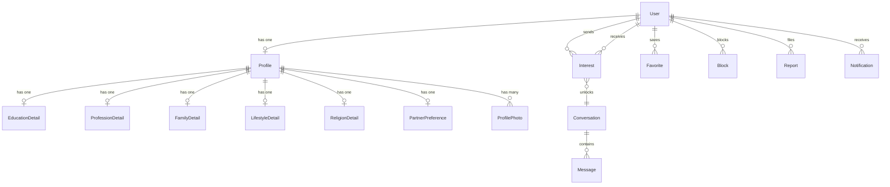

# Matrimony Platform — Architecture & Implementation Plan

## Current State Assessment

| Aspect | Status |
|---|---|
| **Django** | 6.1 (fresh `startproject config .`) |
| **Python** | 3.14.5 (venv has Django; system Python does not) |
| **Database** | SQLite default — will migrate to PostgreSQL |
| **Git** | Not initialized |
| **Packages** | Bare minimum (Django, asgiref, sqlparse) |
| **Custom User** | Not yet created — **must be done before first migration** |
| **Code** | Only Django scaffold files — zero application code |

> [!IMPORTANT]
> The custom user model must be defined and wired into settings **before** running the first `migrate`. The default SQLite `db.sqlite3` that was created by `runserver` will be deleted and re-created once we switch to PostgreSQL and run migrations cleanly.

---

## Proposed Django App Structure

After analyzing all the requirements, I recommend **7 apps** (not 10). Fewer apps with clear boundaries are easier to maintain than many tiny apps with heavy cross-imports.

| App | Responsibility |
|---|---|
| **`core`** | Base template, shared utilities, template tags, middleware, landing page, static assets |
| **`accounts`** | Custom User model, authentication (register/login/logout/password-reset), email verification, account settings, privacy settings, account deactivation/deletion |
| **`profiles`** | Matrimonial profile (personal, education, profession, family, lifestyle, religion), profile photos, profile completion engine, partner preferences |
| **`discovery`** | Profile browsing, search, filtering, sorting, match scoring/ranking |
| **`connections`** | Interests (send/accept/reject/cancel), favorites/shortlist, blocking, reporting |
| **`messaging`** | Conversations, messages (gated by accepted interest), unread counts |
| **`notifications`** | Notification model, in-app notifications, extensible for email/push later |

### Why I'm merging some of your suggested apps

- **`matching` → `discovery`**: "Matching" is really the ranking algorithm inside discovery. It doesn't own its own models — it queries `profiles` data. A separate app would be empty except for a scoring function.
- **`interests` + `favorites` + blocking/reporting → `connections`**: These are all user-to-user relationship operations on the same conceptual axis. Splitting them across 3 apps creates circular imports and fragmented permission logic.
- **`media` → into `profiles`**: Profile photos are tightly coupled to the profile model. A separate app would just re-export profile photo logic. Django's file handling is configured at the settings level, not per-app.
- **`subscriptions`**: Deferred entirely. I'll design the models with a `is_premium` hook on the User, but won't create an empty app now.

---

## Data Model Architecture

### Entity-Relationship Overview



### `accounts.User` (Custom User Model)

| Field | Type | Notes |
|---|---|---|
| `id` | `UUIDField` (PK) | Never expose sequential IDs |
| `email` | `EmailField` (unique) | Login identifier — no username |
| `phone` | `CharField` (optional) | For future SMS verification |
| `is_email_verified` | `BooleanField` | Email confirmation status |
| `is_active` / `is_staff` | Built-in | Django auth integration |
| `date_joined` | `DateTimeField` | Registration timestamp |
| `last_activity` | `DateTimeField` | Updated on login/actions |
| `deactivated_at` | `DateTimeField` (null) | Soft deactivation support |

Uses `AbstractBaseUser` + `PermissionsMixin` with a custom manager (`EmailUserManager`) — email-based authentication, no username.

### `profiles.Profile` (One-to-One with User)

| Field | Type | Notes |
|---|---|---|
| `uuid` | `UUIDField` (unique) | Public-facing identifier for URLs |
| `user` | `OneToOneField(User)` | Owner |
| `display_name` | `CharField` | Public-facing name |
| `date_of_birth` | `DateField` | Age calculated dynamically |
| `gender` | `CharField` (choices) | Male / Female / Other |
| `height` | `PositiveSmallIntegerField` | In centimeters |
| `city` / `state` / `country` | `CharField` | Location (separate fields for filtering) |
| `about_me` | `TextField` | Free-text bio |
| `profile_created_for` | `CharField` (choices) | Self / Son / Daughter / Sibling / etc. |
| `marital_status` | `CharField` (choices) | Never Married / Divorced / Widowed / etc. |
| `visibility` | `CharField` (choices) | Public / Registered-Only / Connections-Only |
| `is_verified` | `BooleanField` | Admin-verified profile |
| `is_complete` | computed | Profile completion percentage |

### Detail Models (OneToOne → Profile)

Separate models for **Education**, **Profession**, **Family**, **Lifestyle**, **Religion**, and **Partner Preferences**. This avoids a single monolithic table with 60+ columns, allows independent editing/validation, and makes profile completion calculation clean.

Each detail model follows this pattern:
- `OneToOneField(Profile, related_name='education')` (etc.)
- Fields specific to that section
- `created_at` / `updated_at` timestamps

**Religion/Cultural Design Decision**: Rather than hard-coding a rigid Hindu/Muslim/Christian hierarchy, I'll use a flexible model:

| Field | Type | Notes |
|---|---|---|
| `religion` | `CharField` | Free-form with common suggestions |
| `caste` | `CharField` (optional) | Only if user chooses to fill |
| `sub_caste` | `CharField` (optional) | Optional granularity |
| `mother_tongue` | `CharField` | Language |
| `gothra` | `CharField` (optional) | Applicable to some communities |

This supports the target audience without making the schema impossible to extend to other cultural contexts.

### `profiles.ProfilePhoto`

| Field | Type | Notes |
|---|---|---|
| `uuid` | `UUIDField` | Public identifier |
| `profile` | `ForeignKey(Profile)` | Owner |
| `image` | `ImageField` | Stored in `MEDIA_ROOT/photos/<user_uuid>/` |
| `is_primary` | `BooleanField` | At most one primary per profile |
| `order` | `PositiveSmallIntegerField` | Display ordering |
| `visibility` | `CharField` (choices) | Public / Connections-Only |
| `is_approved` | `BooleanField` | Moderation status |

File upload handling: validate content type (not just extension), enforce size limits (5 MB), resize/compress with Pillow, generate unique filenames.

### `connections.Interest`

| Field | Type | Notes |
|---|---|---|
| `uuid` | `UUIDField` | Public identifier |
| `sender` | `ForeignKey(User)` | Who sent |
| `receiver` | `ForeignKey(User)` | Who received |
| `status` | `CharField` (choices) | Pending / Accepted / Rejected / Cancelled / Withdrawn |
| `message` | `TextField` (optional) | Short note with the interest |
| `sent_at` | `DateTimeField` | When sent |
| `responded_at` | `DateTimeField` (null) | When accepted/rejected |
| **Constraints** | | `UniqueConstraint(sender, receiver, condition=Q(status='pending'))` — prevents duplicate active interests |

### `connections.Favorite`, `connections.Block`, `connections.Report`

Standard relationship models with UUID PKs, foreign keys to User, timestamps, and appropriate constraints (unique together for Favorite/Block).

### `messaging.Conversation` & `messaging.Message`

| Model | Key Fields | Notes |
|---|---|---|
| `Conversation` | `uuid`, `participant_1`, `participant_2`, `interest` (FK), `created_at` | Created automatically when interest is accepted |
| `Message` | `uuid`, `conversation` (FK), `sender` (FK), `body`, `sent_at`, `read_at` | Server-side permission check: sender must be a participant |

### `notifications.Notification`

| Field | Type | Notes |
|---|---|---|
| `uuid` | `UUIDField` | PK |
| `recipient` | `ForeignKey(User)` | Who receives |
| `notification_type` | `CharField` (choices) | `interest_received`, `interest_accepted`, `new_message`, etc. |
| `title` | `CharField` | Short display text |
| `message` | `TextField` | Detail text |
| `action_url` | `URLField` (optional) | Where to navigate |
| `is_read` | `BooleanField` | Read status |
| `related_object_type` | `CharField` (optional) | For generic linking |
| `related_object_uuid` | `UUIDField` (optional) | The linked object |
| `created_at` | `DateTimeField` | Timestamp |

Extensible design: a `create_notification()` service function that can later trigger email/push in addition to the in-app record.

---

## Authentication & Authorization Architecture

| Concern | Implementation |
|---|---|
| **Auth model** | Custom `User` with email login, `AbstractBaseUser` + `PermissionsMixin` |
| **Registration** | Email + password → email verification flow |
| **Login** | Email + password with rate limiting (django-axes or custom middleware) |
| **Password reset** | Django's built-in password reset views with custom templates |
| **Session** | Django session framework (cookie-based) |
| **Object-level authorization** | Custom mixins: `OwnerRequiredMixin`, `ProfileVisibilityMixin` |
| **IDOR prevention** | All public URLs use UUIDs; all views verify `request.user` owns/has-access-to the object |
| **Brute force** | Login throttling middleware |
| **CSRF/XSS/Clickjacking** | Django defaults (already in middleware stack) |

---

## Profile Completion Engine

Rather than hard-coding a percentage formula, I'll build a declarative completion system:

```python
COMPLETION_RULES = [
    {"section": "basic", "field": "display_name", "weight": 10, "required": True},
    {"section": "basic", "field": "date_of_birth", "weight": 10, "required": True},
    {"section": "basic", "field": "about_me", "weight": 5, "required": False},
    {"section": "education", "field": "highest_education", "weight": 8, "required": False},
    # ...
]
```

The view computes completion percentage, lists missing required fields, and recommends optional fields — all driven by the rules config. Adding new fields to the completion system = adding one dict entry.

---

## Discovery & Matching Architecture

### Filtering

A `FilterSet`-style approach (using `django-filter` or a lightweight custom implementation):

- **Basic filters**: Age range, gender, location, marital status
- **Detail filters**: Education level, profession, income range, religion, caste, language
- **Lifestyle filters**: Smoking, drinking, diet
- **Preference alignment**: Match against the searcher's partner preferences

Filters are additive (`AND`). Each filter is a class that knows how to apply a `Q()` object to a queryset — adding new filters later = adding one class.

### Match Scoring

A pluggable scoring architecture:

```python
class MatchScorer:
    """Base class. Subclass and override score() to change ranking."""
    def score(self, searcher_profile, candidate_profile) -> float: ...

class SimplePreferenceScorer(MatchScorer):
    """Phase 1: counts how many partner-preference criteria the candidate matches."""
```

Phase 1 will implement `SimplePreferenceScorer`. The architecture supports swapping in ML-based scoring later without touching the discovery views.

---

## Security & Privacy Summary

| Threat | Mitigation |
|---|---|
| Sequential ID enumeration | UUID PKs on all public-facing models |
| IDOR | Every view checks `request.user` has permission to the accessed object |
| CSRF | Django CSRF middleware (already enabled) |
| XSS | Django template auto-escaping; `mark_safe()` never used on user input |
| SQL injection | ORM-only queries; no raw SQL |
| Brute-force login | Rate-limiting middleware |
| Malicious file uploads | Content-type validation, Pillow re-encoding, size limits |
| Sensitive data in URLs | UUIDs only; no email/phone/name in URLs |
| Unauthorized messaging | Server-side check: conversation only exists for accepted interests; message sender must be a participant |
| Profile visibility | `visibility` field enforced in all querysets, not just templates |
| Secret key exposure | Moved to `.env`; `.gitignore` excludes `.env` |

---

## Third-Party Dependencies (Minimal)

| Package | Purpose | Why not built-in |
|---|---|---|
| `psycopg[binary]` | PostgreSQL adapter | Required for PostgreSQL |
| `python-dotenv` | `.env` file loading | Already installed; standard practice |
| `Pillow` | Image processing/validation | Required for `ImageField` and safe image handling |
| `django-filter` | Declarative queryset filtering | Saves significant boilerplate vs custom filter logic |
| `djangorestframework` | API endpoints where useful | Per your requirements |

Everything else uses Django built-ins. No unnecessary dependencies.

---

## Project Structure (Target)

```
matrimony/
├── config/                  # Django project config
│   ├── settings/
│   │   ├── __init__.py
│   │   ├── base.py          # Shared settings
│   │   ├── development.py   # Dev overrides
│   │   └── production.py    # Prod overrides
│   ├── urls.py
│   ├── wsgi.py
│   └── asgi.py
├── apps/
│   ├── core/                # Shared utilities, base templates, landing page
│   ├── accounts/            # Custom User, auth, account management
│   ├── profiles/            # Profile models, photos, completion, preferences
│   ├── discovery/           # Search, filter, browse, match scoring
│   ├── connections/         # Interests, favorites, blocks, reports
│   ├── messaging/           # Conversations, messages
│   └── notifications/       # In-app notifications
├── templates/               # Project-level templates
│   ├── base.html
│   ├── components/          # Reusable template partials
│   └── ...
├── static/                  # Project-level static files
│   ├── css/
│   ├── js/
│   └── images/
├── media/                   # User-uploaded files (gitignored)
├── tests/                   # Test suite (mirrors apps/ structure)
├── manage.py
├── requirements/
│   ├── base.txt
│   ├── development.txt
│   └── production.txt
├── .env.example
├── .gitignore
└── README.md
```

> [!NOTE]
> I'm placing apps inside an `apps/` directory to keep the project root clean and make the app boundary explicit. The `apps/` path will be added to Python's path in settings.

---

## Phased Implementation Plan

### Phase 1 — Foundation *(Build First)*

This is the critical foundation. Everything else depends on it.

| Step | What | Details |
|---|---|---|
| 1.1 | Git init + `.gitignore` | Ignore `venv/`, `db.sqlite3`, `.env`, `media/`, `__pycache__/`, `*.pyc` |
| 1.2 | Split settings | `base.py` / `development.py` / `production.py` |
| 1.3 | Environment config | `.env` file with `SECRET_KEY`, `DATABASE_URL`, `DEBUG` |
| 1.4 | PostgreSQL | Install `psycopg`, configure database settings |
| 1.5 | Requirements files | `base.txt`, `development.txt` |
| 1.6 | `core` app | Base template, CSS/JS foundation, landing page |
| 1.7 | `accounts` app | Custom `User` model (before any migrations!) |
| 1.8 | First migration | `makemigrations` → `migrate` against PostgreSQL |
| 1.9 | Authentication | Registration, login, logout, password reset — with templates |
| 1.10 | Base UI | Responsive layout, navigation, landing page |

### Phase 2 — Profiles

| Step | What |
|---|---|
| 2.1 | `Profile` model + detail models (education, profession, family, lifestyle, religion) |
| 2.2 | Profile creation flow (multi-step or sectioned form) |
| 2.3 | Profile editing |
| 2.4 | `PartnerPreference` model |
| 2.5 | Profile completion engine |
| 2.6 | `ProfilePhoto` model + image upload with validation |
| 2.7 | Profile detail page (public-facing) |
| 2.8 | Profile visibility controls |
| 2.9 | Tests for profile CRUD, validation, privacy |

### Phase 3 — Discovery

| Step | What |
|---|---|
| 3.1 | Browse profiles view (paginated, filtered) |
| 3.2 | Filter system (age, gender, location, education, profession, religion) |
| 3.3 | Search functionality |
| 3.4 | Profile card component |
| 3.5 | Match scoring (simple preference-based) |
| 3.6 | Sort by relevance/recency |
| 3.7 | Tests for filtering, scoring, privacy in results |

### Phase 4 — Connections

| Step | What |
|---|---|
| 4.1 | `Interest` model with status workflow |
| 4.2 | Send / cancel / accept / reject interest views |
| 4.3 | Sent interests page |
| 4.4 | Received interests page |
| 4.5 | `Favorite` model + add/remove |
| 4.6 | Favorites list page |
| 4.7 | `Block` model + block/unblock |
| 4.8 | `Report` model + report form |
| 4.9 | Tests for interest workflow, duplicates, authorization |

### Phase 5 — Communication

| Step | What |
|---|---|
| 5.1 | `Conversation` + `Message` models |
| 5.2 | Conversation creation on interest acceptance |
| 5.3 | Conversation list view |
| 5.4 | Message thread view |
| 5.5 | Send message (with permission check) |
| 5.6 | Unread message counts |
| 5.7 | `Notification` model |
| 5.8 | Notification creation service |
| 5.9 | Notifications dropdown/page |
| 5.10 | Tests for messaging permissions, notifications |

### Phase 6 — Trust & Safety

| Step | What |
|---|---|
| 6.1 | Report review admin workflow |
| 6.2 | User blocking enforcement in queries |
| 6.3 | Admin moderation panel (custom admin views) |
| 6.4 | Account deactivation / deletion |
| 6.5 | Login rate limiting |
| 6.6 | Security audit pass |

### Phase 7 — Polish & Production Readiness

| Step | What |
|---|---|
| 7.1 | Comprehensive test suite |
| 7.2 | Error pages (404, 500) |
| 7.3 | Logging configuration |
| 7.4 | Performance optimization (select_related, indexes) |
| 7.5 | Deployment config (collectstatic, ALLOWED_HOSTS, HTTPS) |
| 7.6 | Documentation (README, setup guide) |

---

## User Review Required

> [!IMPORTANT]
> **PostgreSQL**: You mentioned PostgreSQL in the requirements. I need to know:
> - Do you already have PostgreSQL installed locally?
> - If yes, what database name/user/password should I use?
> - If not, should I proceed with SQLite for development and configure PostgreSQL later?

> [!IMPORTANT]
> **Religion/Cultural scope**: I've designed the religion model to be flexible (free-form `religion`, optional `caste`/`sub_caste`/`gothra`). Is this the right level of flexibility, or do you want a more structured approach with predefined choices for specific communities (e.g., a South Asian matrimonial focus)?

---

## Open Questions

1. **Target audience**: Is this primarily for the South Asian / Indian market (where caste, gothra, family details are standard), or a more generalized global platform? This affects field choices and cultural terminology.

2. **Email service**: For email verification and password reset in development — should I use Django's console email backend (prints to terminal) for now?

3. **Primary photo requirement**: Should users be required to upload at least one photo before their profile is visible in discovery, or should photo-less profiles be allowed?

4. **Income display**: Income ranges are sensitive. Should income be visible on the profile detail page, or only shown to accepted connections?

5. **Gender options**: Should this be a binary Male/Female choice (common in traditional matrimonial platforms), or include additional options?

---

## Recommendation: Build Phase 1 First

I recommend starting with **Phase 1 (Foundation)** immediately after your approval. The custom user model is time-critical — it **must** be created before any migrations are run against the real database. Everything else in the project depends on this foundation being solid.

Phase 1 deliverables:
- Git-initialized repository with proper `.gitignore`
- Split settings with `.env` configuration
- Custom `User` model with email-based auth
- Database configured and migrated
- Registration, login, logout, password reset — all working
- Responsive base layout with navigation
- Landing page

This gives us a working, runnable application after the first phase, and every subsequent phase builds on tested foundations.
